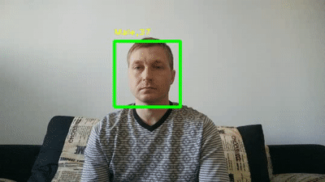
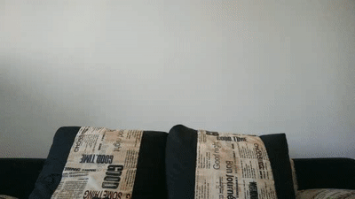

<p align="left">
    <a href="https://www.python.org/">
        </a> &nbsp;
    <br />
    <a href="https://opensource.org/licenses/MIT">
        </a> &nbsp;
</p>

# Agender Project

This is a small demo project to try and test **OpenCV** library
and also implement on-the-fly **face detection, age and gender estimation
using pre-trained models**.

This article can also be found on [medium](https://medium.com/@pavelchernov/age-and-gender-estimation-open-source-projects-overview-simple-project-from-scratch-69581831297e).



What do you do when you want to try something new in deep learning?
Of course you search for articles and open-source projects first!

## Existing Open-Source Projects for Gender and Age Estimation

> Disclaimer: There are many more projects that are not listed here.
> But I believe I have covered the most popular ones,
> that appear at first pages of search results.

### How did I search

I have googled for:
- `gender age estimation`
- `gender age opencv`
- `gender age keras`
- `gender age tensorflow`
- `gender age caffemodel`
- `gender age pytorch`

I was looking at one or two first pages of results only.
Then I excluded:
- articles with restricted access,
- projects without source code,
- projects with source code written in other than python language,
- projects that perform only age or gender estimation, not both,
- project duplicates or copies.

After that I dig into source code to find details of input image format,
output format, model architecture, weight size, license,
pre-trained model availability, etc.

### List of existing projects

Here is what I've found for the topic:

1. [**Age and Gender Classification using MobileNets**](https://medium.com/ymedialabs-innovation/estimating-age-and-gender-with-mobilenets-13eaee1e819c)
by Kinar Ravishankar.
    - Source code: https://github.com/KinarR/age-gender-estimator-keras
    - License: `MIT`
    - Framework: `Keras/TensorFlow`
    - Input: RGB images of any size, author used: `224x224x3`
    - Output:
      - _gender_: two binary classes: Male and Female, choose maximum. 
      - _age_: 21 class, use softmax, choose maximum and multiply it's index by 4.76,
        which gives you roughly [0 - 100] years interval.
    - Model weights size: we can estimate it as this model is based on `MobileNet_v1_224`,
    followed by one `Dense(1024->1024)` layer plus two output `Dense(1024->1)` layers.
    So there are approximately (4.24 MP + 1.05 MP) = 5.29 MP (=Million Parameters).
    Which is about **21 Mb** for `float32`. 
    - Pre-trained model available: **NO**

1. [**How to build an age and gender multi-task predictor with deep learning in TensorFlow**](https://medium.freecodecamp.org/how-to-build-an-age-and-gender-multi-task-predictor-with-deep-learning-in-tensorflow-20c28a1bd447)
by Cole Murray
    - Source code: https://github.com/ColeMurray/age-gender-estimation-tutorial
    - License: unspecified
    - Framework: `TensorFlow`
    - Input: RGB images`224x224x3`
    - Output:
      - _gender_: two binary classes: Male and Female, choose maximum. 
      - _age_: vector of 101 classes probabilities for ages [0..100], choose maximum or use weighted sum
    - Model weights size: we can estimate it from model architecture:
      `Conv(5x5, 3->32)` -> `MaxPool(2->1)` -> `Conv(5x5, 32->64)` -> `MaxPool(2->1)` ->
      `Conv(5x5, 64->128)` -> `MaxPool(2->1)` ->
      `Dense(28*28*128 -> 1024)` -> `Dense(1024 -> 101)`, `Dense(1024 -> 2)`.
      `2400 + 51200 + 204800 + 102760448 + 103424 + 2048 = 103.1MP`
      Which is approximately **393 Mb**.
    - Pre-trained model available: **NO**

1. [**Predicting apparent Age and Gender from face picture : Keras + Tensorflow**](https://medium.com/@CVxTz/predicting-apparent-age-and-gender-from-face-picture-keras-tensorflow-a99413d8fd5e)
by Youness Mansar
    - Source code: https://github.com/CVxTz/face_age_gender
    - License: `MIT`
    - Framework: `Keras/TensorFlow`
    - Input: RGB images `224x224x3`
    - Output:
      - _gender_: one number in range [0..1], where 0 = Female, 1 = Male.
      - _age_: 8 classes [0..2], [4..6], [8..12], [15..20], [25..32], [38..43], [48..53], [60..100],
        use softmax, choose maximum.
    - Model weights size: We can estimate it from model architecture: `ResNet50` -> `Dense(100)` -> `Dense(1)`.
      Approximately: **100 Mb**.
    - Pre-trained model available: **NO**

1. [**SSR-Net: A Compact Soft Stagewise Regression Network for Age Estimation**](https://github.com/shamangary/SSR-Net/blob/master/ijcai18_ssrnet_pdfa_2b.pdf)
by Tsun-Yi Yang, Yi-Hsuan Huang, Yen-Yu Lin, Pi-Cheng Hsiu, Yung-Yu Chuang.
    - Source code: https://github.com/shamangary/SSR-Net
    - Third party source code: https://github.com/shamangary/SSR-Net
    - License: `Apache License 2.0`
    - Framework: `Keras/TensorFlow`
    - Input: RGB images `64x64x3`
    - Output:
      - _gender_: one number in range [0..1], where 0 = Female, 1 = Male.
      - _age_: one number
    - Model weights size:
      - _gender_: **0.32 Mb**,
      - _age_: **0.32 Mb**,
    - Pre-trained model available: **YES**
    - Last models update: Apr 2018

1. [**Mxnet version implementation of SSR-Net for age and gender estimation**](https://github.com/wayen820/gender_age_estimation_mxnet)
by @wayen820
    - Source code: https://github.com/wayen820/gender_age_estimation_mxnet
    - License: unspecified
    - Framework: `MXNET`
    - Input: RGB image `112x112x3`
    - Output:
      - _gender_: one number in range [0..1], where 0 = Female, 1 = Male.
      - _age_: one number
    - Model weights size:
      - _gender_: **3.94 Mb**
      - _age_: **1.95 Mb**
    - Pre-trained model available: **YES**
    - Last models update: Oct 2018

1. [**Age and Gender Classification Using Convolutional Neural Networks**](https://talhassner.github.io/home/publication/2015_CVPR)
by Gil Levi and Tal Hassner.
    - Source code: https://github.com/GilLevi/AgeGenderDeepLearning
    - License: `as is`
    - Framework: `Caffe`. But models could be loaded with `OpenCV`.
    - Input: `256x256x3`
    - Output:
      - _gender_: two binary classes: Male and Female, choose maximum. 
      - _age_: 8 classes: [0..2], [4..6], [8..12], [15..20], [25..32], [38..43], [48..53], [60..100],
        use softmax, choose maximum.
    - Model weights size:
      - _gender_: **43.5 Mb**,
      - _age_: **43.5 Mb**.
    - Pre-trained model available: **YES**, separate models for _gender_ and _age_.
    - Last models update: Sep 2017

1. [**Age and Gender Deep Learning with TensorFlow**](https://github.com/dpressel/rude-carnie)
by Rude Carnie (? Daniel Pressel)
    - Source code: https://github.com/dpressel/rude-carnie
    - License: unspecified
    - Framework: `TensorFlow`
    - Input: RGB images `256x256x3`
    - Output:
      - _gender_: two binary classes: Male and Female, choose maximum.
      - _age_: 8 classes: [0..2], [4..6], [8..12], [15..20], [25..32], [38..43], [48..53], [60..100],
        use softmax, choose maximum.
    - Model weights size: 
      - _gender_: inception_v3 based model - **166 Mb**,
      - _age_: inception_v3 based model - **166 Mb**.
    - Pre-trained model available: **YES**, separate networks for _gender_ and _age_.
    - Last models update: Apr/Feb 2017

1. [**Easy Real time gender age prediction from webcam video with Keras**](https://www.dlology.com/blog/easy-real-time-gender-age-prediction-from-webcam-video-with-keras/)
by Chengwei Zhang
    - Source code: https://github.com/Tony607/Keras_age_gender
    - License: unspecified
    - Framework: `Keras/TensorFlow`
    - Input: RGB images `64x64x3`. Possibly, any size can be chosen.
    - Output:
      - _gender_: one number [0..1], where 1 means Female,
      - _age_: vector of 101 classes probabilities for ages [0..100], choose maximum or use weighted sum
    - Model weights size: **186 Mb**.
    - Pre-trained model available: **YES**
    - Last model update: Jan 2018

1. [**Age and Gender Estimation**](https://github.com/yu4u/age-gender-estimation)
by Yusuke Uchida
    - Source code: https://github.com/yu4u/age-gender-estimation
    - License: `MIT`
    - Framework: `Keras/TensorFlow`
    - Input: RGB image of any size. Author used `32x32x3`
    - Output:
      - _gender_: one number [0..1], where 1 means Female,
      - _age_: vector of 101 classes probabilities for ages [0..100], choose maximum or use weighted sum
    - Model weights size: **187 Mb**.
    - Pre-trained model available: **YES**
    - Last models update: Feb 2018

1. [**Age and gender estimation based on Convolutional Neural Network and TensorFlow**](https://github.com/BoyuanJiang/Age-Gender-Estimate-TF)
by Boyuan Jiang
    - Source code: https://github.com/BoyuanJiang/Age-Gender-Estimate-TF
    - License: `MIT`
    - Framework: `TensorFlow`
    - Input: RGB image `160x160x3`
    - Output:
      - _gender_: one number, 0 = Female, 1 = Male.
      - _age_: one number
    - Model weights size: **246.5 Mb**.
    - Pre-trained model available: **YES**
    - Last models update: Nov 2017

1. [**Apparent Age and Gender Prediction in Keras**](https://sefiks.com/2019/02/13/apparent-age-and-gender-prediction-in-keras/)
by Sefik Ilkin Serengil
    - Source code: https://github.com/serengil/tensorflow-101/blob/master/python/age-gender-prediction-real-time.py
      and also https://github.com/serengil/tensorflow-101/blob/master/python/gender_prediction.ipynb
    - License: unspecified
    - Framework: `Keras/TensorFlow`
    - Input: RGB image `224x224x3`
    - Output:
      - _gender_: one number, 0 = Woman, 1 = Man
      - _age_: vector of 101 classes probabilities for ages [0..100], choose maximum or use weighted sum
    - Model weights size:
      - _gender_: **553 Mb**
      - _age_: **514 Mb**
    - Pre-trained model available: **YES**, separate models for _gender_ and _age_
    - Last models update: Nov 2017

1. [**Multi output neural network in Keras (Age, gender and race classification)**](https://sanjayasubedi.com.np/deeplearning/multioutput-keras/)
by Sanjaya Subedi
    - Source code: https://github.com/jangedoo/age-gender-race-prediction
    - License: unspecified
    - Framework: `Keras/TensorFlow`
    - Input: RGB image `198x198x3`
    - Output:
      - _gender_: one number, 0 = Male, 1 = Female
      - _age_: one number
      - _race_: vector of 5 classes: ['White', 'Black', 'Asian', 'Indian', 'Others']
    - Model weights size: unknown
    - Pre-trained model available: **NO**

### Summary table

No | Name | Article | Source | License | Framework | Input | Output | Size | Pretrained |
---- | ---- | ---- | ---- | ---- | ---- | ---- | ---- | ---- | ---- |
1 | MobileNets by Kinar Ravishankar | [link](https://medium.com/ymedialabs-innovation/estimating-age-and-gender-with-mobilenets-13eaee1e819c) | [link](https://github.com/KinarR/age-gender-estimator-keras) | MIT | Keras/TensorFlow | 224x224x3 | gender: 2 classes, age: 21 classes | **~21Mb** | **NO** |
2 | ConvNet by Cole Murray | [link](https://medium.freecodecamp.org/how-to-build-an-age-and-gender-multi-task-predictor-with-deep-learning-in-tensorflow-20c28a1bd447) | [link](https://github.com/ColeMurray/age-gender-estimation-tutorial) | unspecified | TensorFlow | 224x224x3 | gender: 2 classes, age: 101 classes | **~393Mb** | **NO** |
3 | ResNet50 by Youness Mansar | [link](https://medium.com/@CVxTz/predicting-apparent-age-and-gender-from-face-picture-keras-tensorflow-a99413d8fd5e) | [link](https://github.com/CVxTz/face_age_gender) | MIT | Keras/TensorFlow | 224x224x3 | gender: one number, age: 8 classes | **~100Mb** | **NO** | 
**4** | SSR-Net (original) | [link](https://github.com/shamangary/SSR-Net/blob/master/ijcai18_ssrnet_pdfa_2b.pdf) | [link](https://github.com/shamangary/SSR-Net/) | Apache License 2.0 | Keras/TensorFlow | 64x64x3 | gender: one number, age: one number | **0.32Mb** | **YES** |
5 | SSR-Net on MXNET | None | [link](https://github.com/wayen820/gender_age_estimation_mxnet) | unspecified | MXNET | 112x112x3 | gender: one number, age: one number | **1.95Mb**, **3.94Mb** | **YES** |
**6** | ConvNet by Gil Levi and Tal Hassner | [link](https://talhassner.github.io/home/publication/2015_CVPR) | [link](https://github.com/GilLevi/AgeGenderDeepLearning) | as is | Caffe | 256x256x3 | gender: 2 classses, age: 8 classes | **43.5Mb**, **43.5Mb** | **YES** | 
7 | Inception_v3 by Rude Carnie | None | [link](https://github.com/dpressel/rude-carnie) | unspecified | TensorFlow | 256x256x3 | gender: 2 classses, age: 8 classes | **166Mb**, **166Mb** | **YES** |
8 | ConvNet by Chengwei Zhang | [link](https://www.dlology.com/blog/easy-real-time-gender-age-prediction-from-webcam-video-with-keras/) | [link](https://github.com/Tony607/Keras_age_gender) | unspecified | Keras/TensorFlow | 64x64x3 | gender: 1 number, age: 101 class | **186Mb** | **YES** |
9 | ConvNet by Yusuke Uchida | None | [link](https://github.com/yu4u/age-gender-estimation) | MIT | Keras/TensorFlow | 32x32x3 | gender: 1 number, age: 101 class | **187Mb** | **YES** |
10 | ConvNet by Boyuan Jiang | None | [link](https://github.com/BoyuanJiang/Age-Gender-Estimate-TF) | MIT | TensorFlow | 160x160x3 | gender: one number, age: one number | **246.5Mb** | **YES** |
11 | ConvNet by Sefik Ilkin Serengil | [link](https://sefiks.com/2019/02/13/apparent-age-and-gender-prediction-in-keras/) | [link](https://github.com/serengil/tensorflow-101/blob/master/python/age-gender-prediction-real-time.py) | unspecified | Keras/TensorFlow | 224x224x3 | gender: 1 number, age: 101 class | **553Mb**, **514Mb** | **YES** | 
12 | ConvNet by Sanjaya Subedi | [link](https://sanjayasubedi.com.np/deeplearning/multioutput-keras/) | [link](https://github.com/jangedoo/age-gender-race-prediction) | unspecified | Keras/TensorFlow | 198x198x3 | gender: 1 number, age: 1 number, race: 5 classes | unknown | **NO** |

> Note: I did not include model's accuracy provided by authors in the description
> because it has no meaning when different models are tested on different test datasets!

## Choosing model

I decided to choose two most lightweight networks, which are able to process video on-the-fly
using only average CPU.

My choice is:

1. No 4, SSR-Net, which has separate models for gender and age of size only **0.32 Mb**!
They are very fast in comparision with other models.

2. No 6, models by Gil Levi and Tal Hassner, these are also two separate models for gender and age
that are widely used by developers as they are about **43 Mb**.

Of course I would like to have one neural net for both gender and age estimation.
Maybe I will spend some time and train a model by myself.
In this case I would definitely use staged training technique proposed by SSR-Net authors. 

## This Project Architecture

This simple program randomly chooses a video file from `videos` directory.

Then it reads frame by frame in cycle until the end or until user pressed ESC key.

For each frame:
1. Get a smaller resized frame. As it is faster to process small images and this merely does not affect quality.
1. Find faces on a small frame.
1. Use faces coordinates of a small frame to extract faces patches from original (big) frame.
1. Convert and adjust faces patches to a format that model expects. Construct a blob with all faces.
1. Pass a blob of faces through model(s) to get predicted genders and ages for all faces.
1. Draw a rectangle around each face and a label with estimated gender and age.

Below you may find some more details.

### Initialization

Face detector is initialized basing on the `face_detector_kind` argument:

```python
# Initialize face detector
if (face_detector_kind == 'haar'):
    #face_cascade = cv.CascadeClassifier('face_haar/lbpcascade_frontalface_improved.xml')
    face_cascade = cv.CascadeClassifier('face_haar/haarcascade_frontalface_alt.xml')
else:
    face_net = cv.dnn.readNetFromTensorflow('face_net/opencv_face_detector_uint8.pb', 'face_net/opencv_face_detector.pbtxt')
```

Model to estimate age and gender is initialized basing on the `age_gender_kind` argument:

```python
# Load age and gender models
if (age_gender_kind == 'ssrnet'):
    # Setup global parameters
    face_size = 64
    face_padding_ratio = 0.10
    # Default parameters for SSR-Net
    stage_num = [3, 3, 3]
    lambda_local = 1
    lambda_d = 1
    # Initialize gender net
    gender_net = SSR_net_general(face_size, stage_num, lambda_local, lambda_d)()
    gender_net.load_weights('age_gender_ssrnet/ssrnet_gender_3_3_3_64_1.0_1.0.h5')
    # Initialize age net
    age_net = SSR_net(face_size, stage_num, lambda_local, lambda_d)()
    age_net.load_weights('age_gender_ssrnet/ssrnet_age_3_3_3_64_1.0_1.0.h5')
else:
    # Setup global parameters
    face_size = 227
    face_padding_ratio = 0.0
    # Initialize gender detector
    gender_net = cv.dnn.readNetFromCaffe('age_gender_net/deploy_gender.prototxt', 'age_gender_net/gender_net.caffemodel')
    # Initialize age detector
    age_net = cv.dnn.readNetFromCaffe('age_gender_net/deploy_age.prototxt', 'age_gender_net/age_net.caffemodel')
    # Mean values for gender_net and age_net
    Genders = ['Male', 'Female']
    Ages = ['(0-2)', '(4-6)', '(8-12)', '(15-20)', '(25-32)', '(38-43)', '(48-53)', '(60-100)']
```

### Reading video

Currently video stream is read from random file from `videos` directory.

```python
import os
import cv2 as cv
import numpy as np
import time

# Initialize numpy random generator
np.random.seed(int(time.time()))

# Set video to load
videos = []
for file_name in os.listdir('videos'):
    file_name = 'videos/' + file_name
    if os.path.isfile(file_name) and file_name.endswith('.mp4'):
        videos.append(file_name)
source_path = videos[np.random.randint(len(videos))]

# Create a video capture object to read videos
cap = cv.VideoCapture(source_path)
```

### Detecting faces

Generally, there are two common ways to detect faces:
- using HAAR cascade,
- using trained CNN model.

Of course, CNN model is more accurate, but it requires more computational resources and runs slower.

In this project I decided to implement both ways and choose one via argument `face_detector_kind`.

Detecting faces with either HAAR or ConvNet is very easy:

```python
def findFaces(img, confidence_threshold=0.7):
    # Get original width and height
    height = img.shape[0]
    width = img.shape[1]
    
    face_boxes = []

    if (face_detector_kind == 'haar'):
        # Get grayscale image
        gray = cv.cvtColor(img, cv.COLOR_BGR2GRAY)
        # Detect faces
        detections = face_cascade.detectMultiScale(gray, scaleFactor=1.1, minNeighbors=5)
        
        for (x, y, w, h) in detections:
            padding_h = int(math.floor(0.5 + h * face_padding_ratio))
            padding_w = int(math.floor(0.5 + w * face_padding_ratio))
            x1, y1 = max(0, x - padding_w), max(0, y - padding_h)
            x2, y2 = min(x + w + padding_w, width - 1), min(y + h + padding_h, height - 1)
            face_boxes.append([x1, y1, x2, y2])
    else:
        # Convert input image to 3x300x300, as NN model expects only 300x300 RGB images
        blob = cv.dnn.blobFromImage(img, 1.0, (300, 300), mean=(104, 117, 123), swapRB=True, crop=False)
    
        # Pass blob through model and get detected faces
        face_net.setInput(blob)
        detections = face_net.forward()
        
        for i in range(detections.shape[2]):
            confidence = detections[0, 0, i, 2]
            if (confidence < confidence_threshold):
                continue
            x1 = int(detections[0, 0, i, 3] * width)
            y1 = int(detections[0, 0, i, 4] * height)
            x2 = int(detections[0, 0, i, 5] * width)
            y2 = int(detections[0, 0, i, 6] * height)
            padding_h = int(math.floor(0.5 + (y2 - y1) * face_padding_ratio))
            padding_w = int(math.floor(0.5 + (x2 - x1) * face_padding_ratio))
            x1, y1 = max(0, x1 - padding_w), max(0, y1 - padding_h)
            x2, y2 = min(x2 + padding_w, width - 1), min(y2 + padding_h, height - 1)
            face_boxes.append([x1, y1, x2, y2])

    return face_boxes
```

Please note the global variable `face_padding_ratio` which determines how to enlarge face_box detected by any algorithm.
It's value depends on the face detection algorithm and on age/gender estimation algorithm.
Ideally, you should choose it's value so that faces you get will be very similar to those that model was trained on. 

### Extracting faces patches

This is done in two steps:
1. Convert face `box` coordinates from small frame to the big original frame: `box_orig`.
2. Get part of the original frame specified by coordinates: `face_bgr`.

We could, of course, extract faces from the small frame.
The reason to extract patches from big frame this is that we want to keep as much quality as possible.
But we should keep in mind that this also may require slightly more calculations than in the first case.

```python
def collectFaces(frame, face_boxes):
    faces = []
    # Process faces
    for i, box in enumerate(face_boxes):
        # Convert box coordinates from resized frame_bgr back to original frame
        box_orig = [
            int(round(box[0] * width_orig / width)),
            int(round(box[1] * height_orig / height)),
            int(round(box[2] * width_orig / width)),
            int(round(box[3] * height_orig / height)),
        ]
        # Extract face box from original frame w.r.t. image boundary
        face_bgr = frame[
            max(0, box_orig[1]):min(box_orig[3] + 1, height_orig - 1),
            max(0, box_orig[0]):min(box_orig[2] + 1, width_orig - 1),
            :
        ]
        faces.append(face_bgr)
    return faces
```

Now `faces` list contains faces patches, all of different sizes.

### Estimating age and gender

In most cases neural networks are designed to work in **batch mode**.
I.e. they can process many input samples at ones.
This is especially useful at training time, as such batch mode training usually helps models to converge faster
than in stochastic mode training (one sample at a time).

But before we could feed all faces into model we must resize them into a format that model expects.
At least we should make all faces the same size and normalize their values.

**SSR-Net** expects input to be a tensor of size: `N x 64 x 64 x 3`, where N is the number of faces,
64x64 is the height and width correspondingly and 3 stands for RGB.
Individual values in tensor should be scaled to [0...1].
Please note the function call `cv.normalize(blob[i, :, :, :], None, alpha=0, beta=255, norm_type=cv.NORM_MINMAX)`
which does the required normalization.

**ConvNet by Gil Levi and Tal Hassner** expects input to be a tensor of size: `N x 3 x 227 x 227`,
where N is the number of faces, 3 means channels of RGB and 227x227 is for height and width correspondingly.
Individual channels in tensor should have mean 0 but should not be scaled.
Please note the parameters `scalefactor=1.0` and `mean=(78.4263377603, 87.7689143744, 114.895847746)`
in the function call `cv.dnn.blobFromImages` which do exactly this.

As said, different models require different images preprocessing. So it is done as follows:

```python
def predictAgeGender(faces):
    if (age_gender_kind == 'ssrnet'):
        # Convert faces to N,64,64,3 blob
        blob = np.empty((len(faces), face_size, face_size, 3))
        for i, face_bgr in enumerate(faces):
            blob[i, :, :, :] = cv.resize(face_bgr, (64, 64))
            blob[i, :, :, :] = cv.normalize(blob[i, :, :, :], None, alpha=0, beta=255, norm_type=cv.NORM_MINMAX)
        # Predict gender and age
        genders = gender_net.predict(blob)
        ages = age_net.predict(blob)
        #  Construct labels
        labels = ['{},{}'.format('Male' if (gender >= 0.5) else 'Female', int(age)) for (gender, age) in zip(genders, ages)]
    else:
        # Convert faces to N,3,227,227 blob
        blob = cv.dnn.blobFromImages(faces, scalefactor=1.0, size=(227, 227),
                                     mean=(78.4263377603, 87.7689143744, 114.895847746), swapRB=False)
        # Predict gender
        gender_net.setInput(blob)
        genders = gender_net.forward()
        # Predict age
        age_net.setInput(blob)
        ages = age_net.forward()
        #  Construct labels
        labels = ['{},{}'.format(Genders[gender.argmax()], Ages[age.argmax()]) for (gender, age) in zip(genders, ages)]
    return labels
```

That's it.

## Results

While implementing this project I analyzed different articles and models to estimate human gender and age by image.

I have discovered that there are a lot of good models with high accuracy that are yet too big and slow to compute.

On the other hand there are some small models with lower accuracy that could be used for real-time video processing.

I have successfully used two such models for real-time estimation of age and gender using only average CPU:
- **SSR-Net** by Tsun-Yi Yang, Yi-Hsuan Huang, Yen-Yu Lin, Pi-Cheng Hsiu, Yung-Yu Chuang.
- **ConvNet** by Gil Levi and Tal Hassner.

The result is great. It was fun to do!



Gender is estimated firmly while age estimation fluctuates around true value. All is done in real-time!

### Future thoughts

Nowadays cameras are getting cheaper and are placed literally everywhere.
But we can never have enough people to watch all those cameras.

I believe there exists a demand for small and accurate models that could estimate and describe content
of video stream in real-time.
Models that could run on a RaspberryPI or other small platforms.

But today researches are mostly concentrated on _accuracy_, but not on _applicability_ of their models.
Researchers get more benefits if their model wins first score for **accuracy** in Kaggle competition.
But no benefits if model is the most **efficient** one. i.e. has decent results with significantly less computations.
My thoughts are the same as in this article by Michał Marcinkiewicz:
[**The Real World is not a Kaggle Competition**](https://www.netguru.com/codestories/real-world-is-not-a-kaggle-competition)

Of course, one may argue that analyzing content of a video is still a complex task.
And complex tasks require tons of calculations anyway.

But I see at least several ways to achieve high efficiency:

1. **Soft stagewise regression** as proposed by authors of SSR-Net.
I encourage you to read their [article](https://github.com/shamangary/SSR-Net/blob/master/ijcai18_ssrnet_pdfa_2b.pdf).
It is actually a novel approach in NN training.
I believe that if we re-formulate their basic idea it can be distributed to all other areas of deep learning.
Not only to regression but also to classification, feature extraction, etc.

2. **Layers reusage** as proposed by Okan K ̈op ̈ukl ̈u, Maryam Babaee, Stefan H ̈ormann, Gerhard Rigol
in their article [CONVOLUTIONAL NEURAL NETWORKS WITH LAYER REUSE](https://arxiv.org/pdf/1901.09615.pdf).
Why use many layers each with their own parameters if we can repeat the same filters multiple times?

3. **Hidden units reusage**. I did not find any article or even mention of this simple idea.
Please tell me if you know any. The idea is described below.

#### Hidden units reusage

A typical content analyzing pipeline consists of several modules running in sequence or in parallel.

For instance, in this simple project we have:

1. `Input frame` -> `ConvNet to detect faces` -> `faces`
2. `faces` -> `ConvNet to estimage gender` -> `genders` 
3. `faces` -> `ConvNet to estimage age` -> `ages` 

Where 2 and 3 may run in parallel.

In more sophisticated projects we could also find:
- `Input frame` -> `ConvNet to recognize common objects` -> `COCO names` 
- `Input frame` -> `ConvNet for semantic segmentation` -> `segmented image mask`

Note that each `ConvNet` typically consists of many sequential layers.
But I guess that **first convolution layers of different networks are very similar**.

I believe that if you take two different networks trained for different tasks,
you will find similar filter's weights in first layers of both networks.
As they act like basic filters for borders detection.

**It means that in complex projects similar filters process the same image several times.**

I.e. first you apply these filters when you find faces in image.
Then you again apply these (or similar) filters when you detect gender of a person.
And then again - when you estimate person's age.

We can save processing time if we get rid of unnecessary calculations and reuse hidden units
as results of first layer's filters applied to input image.

Of course, it's a little bit challenging as it requires:
- specially choose pretrained first layers,
- freeze their parameters when training rest of model layers,
- extract hidden units values, which could be hard in some frameworks.

That is it.
Thank you for reading!

### TODO:
- [X] Search for projects for face and gender estimation.
- [X] Dig inside each project and describe all projects found.
- [X] Choose one or two projects and insert their code into my demo project.
- [X] Implement video reading with OpenCV, face-detection and age and gender estimation.
- [X] Add argument to detect faces either with HAAR or with CNN.
- [X] Add argument to choose model for age and gender estimation.
- [X] Debug and refactor code.
- [X] Write this short article.
